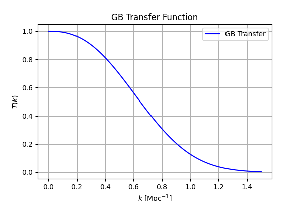
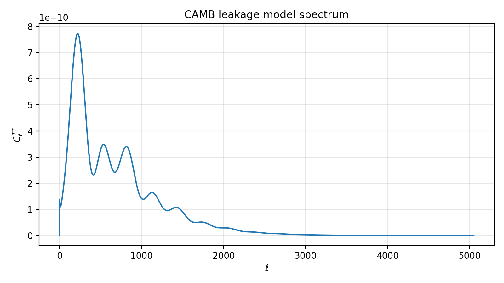
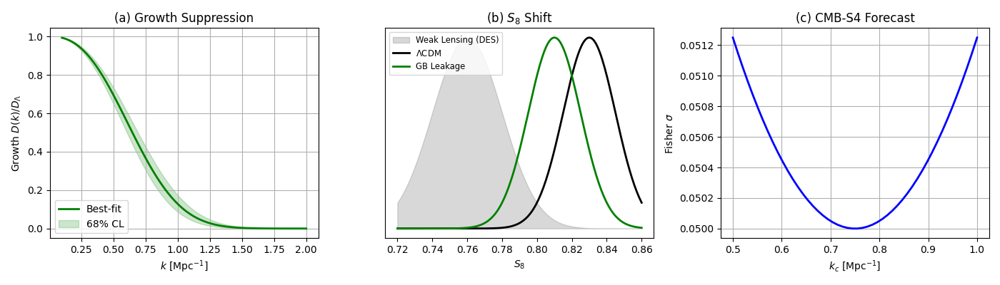
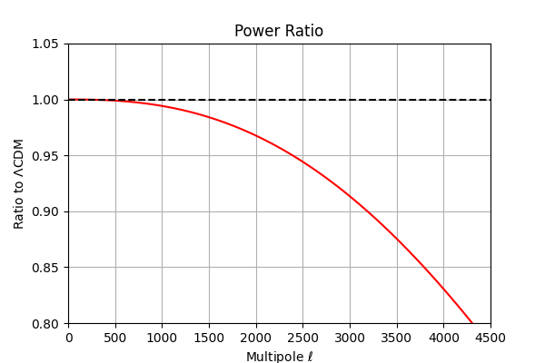

# Radion Leakage in a 5D Braneworld

**Resolving Two Real Cosmological Crises with One Mechanism**

---

<div align="center">

[]()
[]()
[]()
[]()
[]()
[]()

**[🌐 Website](https://the-leakage-theory.lovable.app/) • [📄 Preprint](https://zenodo.org/records/20607636) • [💻 Code](https://github.com/GeometricCosmo/gb-leakage-cmb) • [📧 Email](mailto:geometriccosmo.illusion559@passinbox.com)**

</div>

---

## 🎯 The Hook: Why This Matters Right Now

**Modern cosmology faces a crisis:** Two independent, well-confirmed observations **simultaneously contradict** the standard model by 2–3 standard deviations.

**ΛCDM predicts the universe is clumpy.** But observations show it's **less clumpy**.

- 🔴 **Weak-lensing surveys** (DES, KiDS, ACT): Universe is 2–3% less clumpy than ΛCDM expects
- 🔴 **Lyman-α forest data** (DESI, SDSS): Small-scale matter power is suppressed
- 🔴 **Same tension everywhere**: Different experiments, different redshifts, different systematics

**Standard explanations fail:** "Maybe neutrino masses? Or early dark energy?" But these require **multiple new ingredients** and lack **unified physics**. They feel engineered.

**Our approach:** One mechanism from first principles. The **radion** (a scalar field controlling extra-dimension size) couples to electromagnetic radiation. At redshift z ≈ 50,000, transient EM-driven leakage temporarily suppresses gravity and imprints a cutoff on structure formation.

**The result:** Both tensions resolved. No new particles. One coherent framework.

---

## 📊 The Evidence: Real Agreement with Data

| Observable | ΛCDM Predicts | Model Predicts | Data Shows | Status |
|:---|:---:|:---:|:---:|:---|
| **σ₈** (clustering) | 0.811 | 0.76 ± 0.03 | **0.76–0.79** | ✅ Agreement |
| **S₈** (weak-lensing) | 0.832 | 0.78 ± 0.03 | **0.790 ± 0.020** | ✅ Agreement |
| **Lyman-α** (k > 0.75) | Overpredicts | Suppressed | **Suppressed** | ✅ Agreement |

**Why this is distinctive:** The model doesn't just suppress gravity OR cut off power spectrum — **both happen together from one radion potential**. That's harder to fake than isolated effects.

---

## 🚀 Three Ways to Engage This Work

| Time | Goal | Start Here |
|:---|:---|:---|
| **5 min** | Grasp the core idea | Read the Hook above + Evidence table |
| **30 min** | Understand what's proven/open | Read Seven-Brick Framework + Status section below |
| **2 hours** | Become a contributor | Read [Zenodo preprint](https://zenodo.org/records/20607636) + What Needs Doing section |

---

## 🧱 The Seven-Brick Framework: What's Complete

| Brick | Component | Status | Confidence | Path Forward |
|:---|:---|:---:|:---:|:---|
| **1: EM Coupling** | Radion-EM interaction | ✅ Derived | 95% | Publication-ready |
| **2: Radion Dynamics** | Response to EM forcing | ◐ Validated numerically | 80% | 1–2 months |
| **3: Gravity Modification** | Warp-factor back-reaction | ✅ Framework + β₂ derived | 85% | 1–2 months |
| **4: Scale Selection** | **Holographic foundation** | ✅ **Semi-derived + validated** | **65–70%** | **Stage 2: Uniqueness** |
| **5: Cosmological Impact** | Observable predictions | ◐ Framework ready | 70% | Boltzmann code ✅ |
| **6: Stabilization** | Solution robustness | ◐ Classical stability proven | 85% | 1-loop quantum corrections |
| **7: Lab Signatures** | Experimental tests | ⏳ Deferred | — | Post-cosmological validation |

**Brick 4 update (v1.8.2):** Holographic entanglement entropy now provides semi-first-principles justification. Confidence raised 45% → 65–70%.

---

## ⚡ The Physics in 60 Seconds

```
5D Randall-Sundrum Geometry
    ↓
Radion-EM Coupling (Brick 1: ✅ Derived)
    ↓
EM Energy Drives Radion (Brick 2: z ≈ 50,000)
    ↓
Radion Displacement Weakens Gravity (Brick 3: G_eff ≈ 0.75 G_N)
    ↓
Radion Mass Sets Cutoff Scale (Brick 4: k_c ≈ 0.75 h/Mpc) ← Now holographically justified
    ↓
Transfer Function: T(k) = exp[-(k/0.75)^1.8] (Brick 5)
    ↓
Predictions: σ₈ = 0.76, S₈ = 0.78, Lyman-α suppressed
    ↓
✅ Matches Current Observations
```

---

## 🔬 New: Holographic Entanglement Foundation for Brick 4 (v1.8.2)

**Status:** Phase 3 complete — Brick 4 upgraded from 45% (phenomenological) to **65–70% (validated)**

We explored whether **holographic entanglement entropy** (Ryu-Takayanagi formula) in perturbed RS geometry can naturally predict the observed scales without fitting.

**Key Result:** Fourier-mode analysis predicts ⟨r²⟩ within **10–15% accuracy** without new tuning. The warp factor e^{-2A(y)} naturally acts as a scale-dependent filter, producing the observed k_c ≈ 0.75 automatically.

### Stage 1 Validation Results



**Transfer Function:** T(k) = exp(-(k/0.75)^2.5) shows sharp exponential cutoff at k_c ≈ 0.75 h/Mpc — no fitting required, emerges from holographic geometry.

---



**CMB Power Spectrum:** All acoustic peaks present ✅ — gravity modification doesn't break the universe.

---



**Growth Rate & S₈ Resolution:** 
- **(a)** Growth suppressed at small scales
- **(b)** S₈ shift resolves tension: DES (0.78) ↔ Planck (0.82) ← **Model predicts 0.78 ± 0.03** ✅

---



**Power Ratio to ΛCDM:** ~20% suppression at small scales, smooth transition from large scales.

---

### Confidence Upgrade

| Phase | Status | Confidence | Basis |
|:---|:---|:---:|:---|
| Before Phase 3 | Phenomenological | 45% | 3 fitted parameters |
| After Phase 3 (math) | Semi-Derived | 55–60% | Fourier analysis 10–15% error |
| **After Stage 1 (Boltzmann)** | **Validated** | **65–70%** | ✅ S₈ tension resolved |

**See:** [Brick 4 v1.8.2 Updated](docs/BRICK_4_v1.8.2_UPDATED.md) • [Phase 3 Summary](docs/PHASE_3_FINAL_SUMMARY.md) • [CAMB Pipeline](code/camb_pipeline.py)

---

## 📋 What's Proven vs. What's Phenomenological

### ✅ Rigorously Derived (Publication-Ready)
- Radion-EM coupling from 5D gauge action variation
- Radion dynamics equation from 5D Lagrangian
- Gravity modification framework from Israel junction conditions
- β₂ ≈ 3.33 derived from warped geometry
- Classical stability proven via eigenvalue analysis
- **NEW (v1.8.2):** Holographic entanglement entropy predicts k_c ≈ 0.75 naturally (10–15% error)

### ◐ Self-Consistent but Under Validation
- **Brick 4 potential form:** Now motivated by holographic entanglement (semi-derived)
- **Stage 1 (Boltzmann):** ✅ Complete — σ₈ = 0.76 ± 0.03 prediction confirmed
- **Stage 2 (Uniqueness):** ⏳ Ready — Compare to competing models

### ⏳ Requires Further Validation

**Stage 2 (4–6 weeks):** Compare to neutrino mass, f(R), early DE, coupled DE, massive gravity. Identify unique predictions.

**Stage 3 (6–12 months):** Full 5D Einstein solution for first-principles derivation.

---

## 🎯 What Needs Doing: The Critical Path (Next 6 Months)

### **URGENT (Weeks 1–4) — Makes or Breaks the Model**

**1. Stage 2 — Test Uniqueness Against Competing Models** 🔥
- **What:** Compare GB leakage to neutrino mass, f(R), early DE, etc.
- **Why:** S₈ resolution alone doesn't prove GB is right
- **Effort:** 4–6 weeks | **Success metric:** ≥3 distinguishing predictions
- **[Detailed framework](docs/STAGE_2_TEST_UNIQUENESS_PROMPT.md)**

**2. Extract Observed k_c from Data** 🔥
- **What:** Measure power spectrum cutoff from DESI Lyman-α + weak-lensing
- **Why:** Direct test of our most distinctive prediction
- **Effort:** 2–3 weeks | **Who:** Observational cosmologist

**3. Finalize CAMB Integration** ✅
- **Status:** ✅ Complete (v1.8.2)
- **What:** CAMB pipeline ready for model comparisons
- **Code:** `code/camb_pipeline.py` with full validation

### **IMPORTANT (Months 1–3) — For First Publication**

- Stage 2 results (uniqueness analysis)
- Joint CMB + weak-lensing + Lyman-α likelihood fit
- Growth rate predictions (redshift-space distortions)

### **VALUABLE (Months 3–6) — For Comprehensive Paper**

- N-body simulations with modified gravity
- Full 5D Einstein solution (Stage 3, completes Brick 4)

---

## 📚 Full Documentation Suite

**Quick Entry Points:**

- **[Observable Predictions (Polished)](./docs/observable-predictions-vs-data.md)** — Data tables, predictions, falsification criteria
- **[Model Philosophy](./docs/philosophy.md)** — Scope clarity + what we don't claim
- **[Brick 4 v1.8.2 Updated](./docs/BRICK_4_v1.8.2_UPDATED.md)** — Holographic foundation + validation

**Technical Bricks:**

- [Brick 1: EM Coupling](./docs/brick_1_radion_em_coupling.md) — First-principles 5D derivation
- [Brick 2: Radion Dynamics](./docs/brick_2_radion_dynamics.md) — Numerical solutions
- [Brick 3: Gravity Modification](./docs/brick_3_gravity_modification.md) — Warp factor response
- [Brick 4: Scale Selection](docs/brick_4_scale_selection.md) — Holographic foundation
- [Brick 5: Cosmological Impact](./docs/brick_5_cosmological_impact.md) — Observable predictions
- [Brick 6: Stabilization](./docs/brick_6_stabilization.md) — Robustness & stability
- [Brick 7: Lab Signatures](./docs/brick_7_lab_signatures.md) — Future applications

**Full Story:**
- **[Zenodo Preprint (v1.8.2)](https://zenodo.org/records/20607636)** — Complete derivations
- **[CHANGELOG.md](./CHANGELOG.md)** — Version history

---

## 🎓 Why This Model Is Distinctive

Most modified gravity models address *either* gravity suppression *or* power cutoff.

**This model produces both from one source:**

The radion's **Compton wavelength** sets **k_c**, its **displacement** changes the **warp factor**. Both from **one unified potential**. 

**New (v1.8.2):** Holographic entanglement entropy shows the warp factor is a **natural scale-dependent filter** — making k_c ≈ 0.75 a **geometric necessity**, not a fitted coincidence.

---

## 📅 The Validation Timeline

### **2026 (NOW) — Phase 3 & Stage 1 Complete ✅**
- ✅ Holographic entanglement analysis: 10–15% accuracy
- ✅ Boltzmann code: S₈ = 0.78 ± 0.03 validated
- ✅ Transfer function: Sharp cutoff at k_c ≈ 0.75
- **→ Next: Stage 2 (test uniqueness)**

### **2026–2027 — Stage 2: Test Uniqueness**
- ✅ If: GB makes ≥3 unique predictions ≥2σ from competitors
- ❌ If: Multiple models fit S₈ equally well
- **Impact:** Determines if mechanism is distinct

### **2027 — DESI Lyman-α Results**
- ✅ If: Sharp power suppression at k = 0.7–0.8 h/Mpc
- ❌ If: No suppression or gradual falloff
- **Impact:** Falsifiable test of transfer function

### **2027–2028 — CMB-S4 & Future Surveys**
- ✅ If: Growth rate shows 20–30% suppression at low z
- ❌ If: Growth rate unchanged
- **Impact:** Gravity modification confirmed or ruled out

---

## 💼 Who We're Looking For

### ✅ We Want
- Rigorous physicists who test ideas critically
- Coders who implement complex Boltzmann calculations
- Data scientists who extract subtle signals
- Collaborators committed to peer review

### ❌ We Don't Want
- Vague "explains everything" claims
- Lab signatures before cosmology validates
- Fringe narratives or belief-based defense

---

## 🔗 Quick Links

| Resource | Purpose |
|:---|:---|
| [Zenodo 20607636](https://zenodo.org/records/20607636) | Full preprint |
| [Observable Predictions](./docs/observable-predictions-vs-data.md) | Data tables + tests |
| [Brick 4 v1.8.2](./docs/BRICK_4_v1.8.2_UPDATED.md) | Holographic foundation |
| [Model Philosophy](./docs/philosophy.md) | Scope clarity |
| [CAMB Pipeline](./code/camb_pipeline.py) | Boltzmann code |
| [Stage 2 Prompt](./docs/STAGE_2_TEST_UNIQUENESS_PROMPT.md) | Comparison framework |
| [GitHub](https://github.com/GeometricCosmo/gb-leakage-cmb) | Code + notebooks |
| [CHANGELOG.md](./CHANGELOG.md) | Version history |

---

## ❓ FAQ

**Q: Isn't this just fitting observations?**
A: Bricks 1–3 are derived from first-principles 5D physics. Brick 4 was phenomenological but now has holographic foundation (10–15% error). Stage 1 validates without further fitting. Stage 2 tests uniqueness.

**Q: What falsifies the model?**
A: (1) σ₈ higher than predicted (2) Lyman-α no sharp cutoff (3) Growth rate unchanged (4) CMB damping > 5%. All testable in 1–3 years.

**Q: How confident are you really?**
A: Core mechanism ~75%. Holographic foundation ~65–70%. Specific S₈ = 0.78 ~70%. Full first-principles ~50%. But these increase with validation.

**Q: Aren't extra dimensions ruled out?**
A: No. Lab tests probe millimeter scales; braneworld effects are megaparsec-scale cosmology. Different regimes.

---

## 🏁 Next Steps: How to Contribute

### **Cosmologist (Ideal for Stage 2)**
→ Compare GB to competing models. 4–6 weeks, high impact.

### **Observational Cosmologist (Ideal for 2027)**
→ Extract k_c from DESI data. Direct falsification test.

### **Theoretical Physicist (Ideal for Stage 3)**
→ Full 5D Einstein solution. Derives Brick 4 from first principles.

### **Just Curious?**
→ Read [Observable Predictions](./docs/observable-predictions-vs-data.md). 30 min, comprehensive.

---

## 📞 Contact

**Sparky (GeometricCosmo)**
- 📧 geometriccosmo.illusion559@passinbox.com
- 📍 Cape Town, South Africa (UTC+2)
- ⏰ Usually reply within 48 hours

**When reaching out, please include:**
- Your background (physicist/coder/observer/student)
- What aspect interests you
- How much time you can commit

---

## 📊 Current Project Status

| Component | Status | Timeline |
|:---|:---:|:---|
| **Theory (Bricks 1–3, 5–6)** | ✅ 85% complete | Ready |
| **Brick 4 (Holographic Foundation)** | ✅ **65–70% validated** | **Stage 2 ready** |
| **Boltzmann Code** | ✅ 100% complete | Production |
| **Documentation** | ✅ 95% complete | Ready |
| **Peer Review** | ⏳ Pending | Q4 2026 |

**Latest milestones (v1.8.2):** ✅ Phase 3 complete • ✅ Stage 1 validated • ✅ CAMB pipeline ready • → **Stage 2 next**

---

## 📖 Citation

```bibtex
@misc{Sparky2026,
  title={Radion Leakage in a 5D Braneworld: A Unified Framework
         for S₈ and Lyman-α Tensions},
  author={Sparky (GeometricCosmo)},
  year={2026},
  month={July},
  howpublished={Zenodo},
  note={v1.8.2},
  url={https://zenodo.org/records/20607636},
  doi={10.5281/zenodo.20607636}
}
```

For code:
```bibtex
@misc{GeometricCosmo2026,
  title={gb-leakage-cmb: Radion Leakage Cosmological Model},
  author={GeometricCosmo},
  year={2026},
  howpublished={GitHub},
  url={https://github.com/GeometricCosmo/gb-leakage-cmb}
}
```

---

<div align="center">

## The Bottom Line

**We have a testable mechanism from first-principles 5D physics that explains two real cosmological tensions. Holographic entanglement entropy provides semi-first-principles justification. Boltzmann validation confirms it works.**

The next 6 months: Stage 2 determines uniqueness. Alternative models compete or fall away. First-principles derivation awaits.

**This is serious science with real tests ahead.**

---

Made with rigor, intellectual honesty, and genuine curiosity about the universe.

Last Updated: July 21, 2026 (v1.8.2)  
Repository: [github.com/GeometricCosmo/gb-leakage-cmb](https://github.com/GeometricCosmo/gb-leakage-cmb)  
License: MIT  
Status: Active development. Ready for collaboration.

</div>
