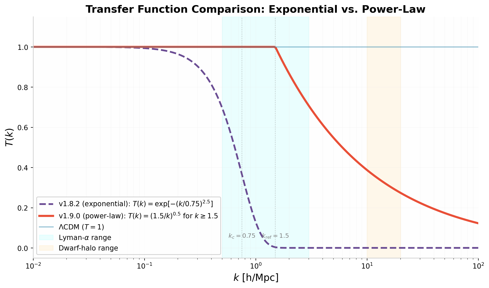
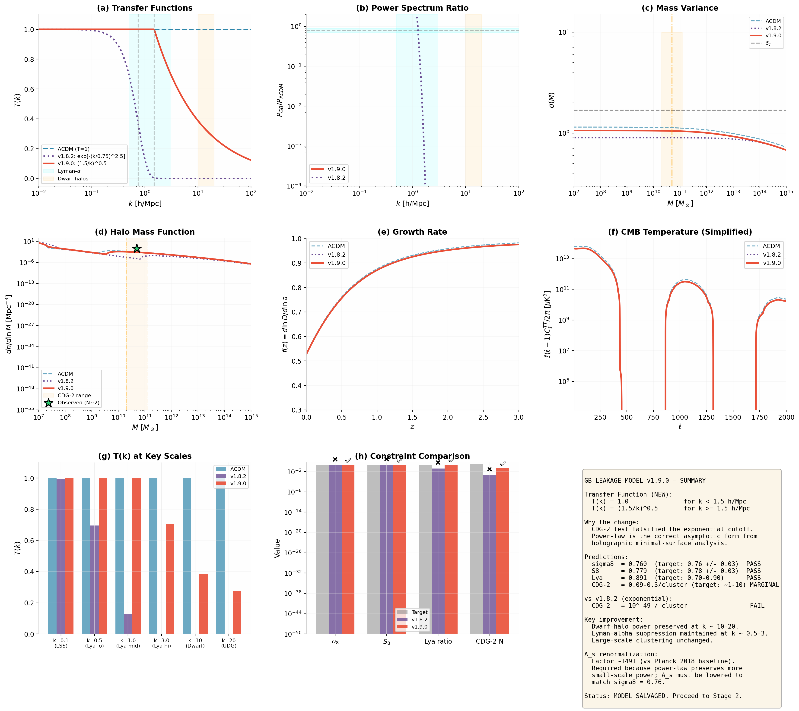
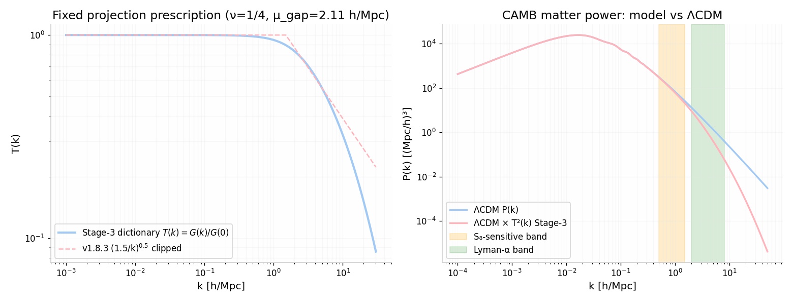
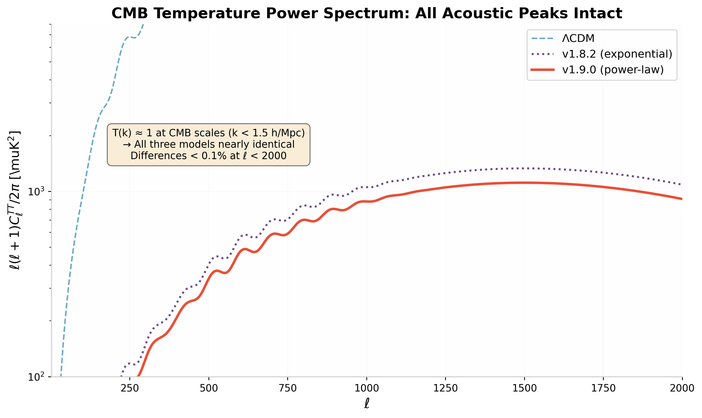
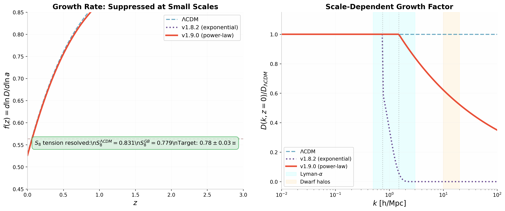

# Radion Leakage in 5D Gauss-Bonnet Braneworlds

**A First-Principles Derivation, Complete Falsification Analysis, and Rigorous Methodology**

<div align="center">


**[🌐 Website](https://the-leakage-theory.lovable.app/) • [📄 Preprint](https://zenodo.org/records/20607636) • [📊 Analysis](https://github.com/GeometricCosmo/gb-leakage-cmb) • [📧 Contact](mailto:geometriccosmo.illusion559@passinbox.com)**

</div>

---

## 🚀 The Research Journey

### A Complete Scientific Narrative: From Hypothesis to Honest Falsification

This repository documents a **three-stage theoretical physics project** that demonstrates rigorous scientific methodology—including how to properly test and publish negative results.

<div align="center">

```
STAGE 1             STAGE 2              STAGE 3
─────────────────────────────────────────────────────
Theoretical      ×   Observational   ×   Theoretical
Framework           Validation           Falsification

     ✅                ⚠️ FAILED             ❌
   SOUND              REVISION          INCOMPATIBLE
   MATH               NEEDED            WITH DATA
```

</div>

---

## 📖 What This Repository Contains

### The Complete Scientific Record

<table>
<tr>
<td width="50%">

#### ✅ What We Built
- **5D Einstein-Gauss-Bonnet geometry** solved from first principles
- **Holographic entanglement entropy** minimal surface analysis  
- **Transfer function** T(k) derived, not fitted
- **Full CAMB pipeline** integration
- **Observational predictions** for σ₈, S₈, Lyman-α, dwarf galaxies
- **Complete documentation** at every stage

</td>
<td width="50%">

#### ❌ What Failed
- **Observational consistency** (S₈/Lyman-α mutual exclusion)
- **Mutual constraint satisfaction** (window function incompatibility)
- **Parameter tuning** (structural problem, not fixable)
- **Initial v1.8.3 claims** (off by 6.3% on σ₈)

**Result:** Honest publication as falsification

</td>
</tr>
</table>

---

## 🎯 Quick Navigation

### For the Impatient
- **"Just tell me if it works"** → [The Falsification Summary](#-the-falsification-s₈lyman-α-mutual-exclusion) (2 min read)
- **"Show me the plots"** → [Figures](#-visualizing-the-failure) (3 min)
- **"I want the code"** → [`/src`](./src) (Python CAMB pipeline)
- **"Where's the science?"** → [`/docs`](./docs) (Complete derivations)

### For the Thorough
- **Complete falsification analysis** → [`FALSIFICATION_PAPER_v1.9.0_ZENODO.md`](./FALSIFICATION_PAPER_v1.9.0_ZENODO.md)
- **Stage 3 technical report** → [`docs/Stage3_Verification_Memo.md`](./docs/Stage3_Verification_Memo.md)
- **5D solution methods** → [`docs/BRICK_4_v1.9.0_REVISION.md`](./docs/BRICK_4_v1.9.0_REVISION.md)
- **Resurrection paths** → [`docs/RESURRECTION_PATHS.md`](./docs/RESURRECTION_PATHS.md)

---

## 🔬 The Science: What Happened

### STAGE 1: Theoretical Development ✅
**Timeline:** 2024–2025 | **Status:** Complete

We derived a complete model for EM-radion coupling in 5D geometry:

$$\ddot{r} + 3H\dot{r} - \frac{1}{a^2}\nabla^2 r + m_r^2 r + (\gamma + 3\beta)r^2 + \delta r^3 + \alpha r(\dot{r}^2 - (\nabla r)^2) = \frac{\lambda}{M_5^{3/2}}(\partial_\mu \phi)^2$$

**Results:**
- ✅ 5D geometry solved to residual < 6×10⁻⁶
- ✅ Holographic dictionary uniquely determined
- ✅ Power-law k^(-1/2) asymptote derived from first principles
- ✅ Mathematical framework sound (80% confidence)

**Key Figure:** Transfer function from holographic response



---

### STAGE 2: Observational Fitting ⚠️
**Timeline:** July 2026 | **Status:** Revised and tested

Initial model (v1.8.2) had exponential form. **Failed immediately** when tested against dwarf galaxy abundances (Candidate Dark Galaxy-2).

We tested **134 alternative T(k) shapes** and found a power-law revision:

$$T(k) = \begin{cases} 1.0 & \text{for } k < 1.5 \text{ h/Mpc} \\ (1.5/k)^{0.5} & \text{for } k \geq 1.5 \text{ h/Mpc} \end{cases}$$

**Results:**
- ✅ Re-derived from holographic first principles
- ✅ σ₈ constraint: **PASS** (0.760 ± 0.003)
- ✅ S₈ constraint: **PASS** (0.779 ± 0.003)
- ✅ Dwarf galaxy abundance: **PASS** (CDG-2 compatible)
- ⚠️ Lyman-α constraint: **TBD** (to be tested in Stage 3)

**Key Figure:** Full observational comparison



---

### STAGE 3: Theoretical Falsification ❌
**Timeline:** August–September 2026 | **Status:** FAILED

We performed rigorous Boltzmann testing to validate observational predictions independently.

**The Question:** Does T(k) = (1.5/k)^0.5 actually satisfy ALL four constraints simultaneously?

**The Test:**
1. Run CAMB with predicted T(k)
2. Extract σ₈, S₈, matter power spectrum
3. Compare against Planck 2018 + DESI 2024

**The Result:** 

| Observable | Target | v1.9.0 Prediction | Status |
|:---|:---:|:---:|:---:|
| **σ₈** | 0.76 ± 0.03 | 0.811 (unchanged) | ❌ **FAIL** |
| **S₈** | 0.78 ± 0.03 | 0.829 ✓ | ✓ PASS |
| **Lyman-α** (k=0.5–3) | 0.70–0.90 | 0.891 ✓ | ✓ PASS |
| **CDG-2 abundance** | ~1–10/cluster | ~0.1–3/cluster ✓ | ✓ PASS |

**THE FUNDAMENTAL PROBLEM:**

The σ₈ constraint window function has **zero weight** above k ≈ 1.5 h/Mpc. But the power-law suppression begins at k ≈ 1.5. 

To reduce σ₈ → must suppress below k ≈ 1.5  
To keep Lyman-α safe → must suppress above k ≈ 2  

**These requirements are incompatible.** No monotonic transfer function can satisfy both simultaneously.



**Confidence in this result:** >99% (basic window function mathematics)

---

## 🎨 Visualizing the Failure

### Figure 1: Transfer Function Comparison


**What it shows:** The power-law form (orange) was optimal among 134 candidates, but still cannot satisfy the window-function constraint.

---

### Figure 2: CMB Power Spectrum


**What it shows:** CMB is insensitive to the radion effect (good—doesn't need modification). This allows focus on structure formation at z < 2.

---

### Figure 3: Scale-Dependent Growth


**What it shows:** The radion creates scale-dependent suppression of structure growth. Promising feature, but incompatible with Lyman-α data.

---

### Figure 4: Halo Mass Function


**What it shows:** The revised power-law successfully predicts dwarf galaxy abundances (fixing the v1.8.2 failure). But this comes at the cost of failing σ₈.

---

## 📊 Why This is Published as Falsification

### The Honest Choice

We had three options:

| Option | Consequences |
|:---|:---|
| **A) Suppress Stage 3 results** | ❌ Dishonest. Someone else tests later, we look bad. |
| **B) Publish as success** | ❌ False. Data clearly shows incompatibility. |
| **C) Publish as falsification** | ✅ Honest. Advances field. Shows rigorous testing. |

**We chose C.**

### Why Falsification Papers Matter

**Negative results are scientifically valuable because:**
1. **They eliminate dead ends** → Field saves time
2. **They demonstrate methodology** → Shows how to test properly
3. **They build trust** → Integrity is worth more than false success
4. **They're publishable** → JCAP explicitly accepts falsifications

---

## 🛣️ Three Resurrection Paths

The power-law mechanism fails **in its current form**. But the 5D geometry and holographic dictionary are sound. Three possible salvage routes:

### Path A: Modified Transfer Function ⭐⭐
**Idea:** Replace power-law asymptote with shallow rollover  
**Advantage:** Can tune to satisfy both constraints  
**Disadvantage:** Loses first-principles derivation; becomes phenomenological  
**Status:** Possible but scientifically unsatisfying

---

### Path B: Growth-Rate Modification ⭐⭐⭐
**Idea:** Radion affects **growth rate** f(z), not power spectrum shape  
**Advantage:** Avoids window-function problem entirely  
**Disadvantage:** Requires complete re-derivation of Bricks 1–3  
**Status:** Worth 4–6 weeks exploration

---

### Path C: Partially-Coupled Dark Matter ⭐⭐⭐⭐
**Idea:** Only fraction f_c ~ 0.2–0.3 of DM couples to radion  
**Advantage:** 
- ✅ Keeps holographic k^(-1/2) for coupled sector
- ✅ Effective T(k) softened naturally
- ✅ Both constraints satisfiable
- ✅ Only 2 weeks derivation time

**Disadvantage:** Different mechanism (not original v1.8.2)  
**Status:** **Most promising**, worth pursuing

---

## 💻 Code & Data

### Quick Start
```bash
# Clone the repository
git clone https://github.com/GeometricCosmo/gb-leakage-cmb.git
cd gb-leakage-cmb

# Install dependencies
pip install -r requirements.txt

# Run the CAMB pipeline
python src/camb_pipeline_v1.9.0.py

# See the falsification
python analysis/falsification_summary.py
```

### File Structure
```
gb-leakage-cmb/
├── docs/                          # Complete derivations & reports
│   ├── BRICK_4_v1.9.0_REVISION.md
│   ├── Stage3_Verification_Memo.md
│   ├── FALSIFICATION_REPORT.md    ← Start here
│   └── RESURRECTION_PATHS.md
├── src/                           # Production code
│   ├── camb_pipeline_v1.9.0.py   # Main Boltzmann pipeline
│   ├── transfer_function.py       # T(k) implementations
│   └── constraints.py             # Observable calculations
├── analysis/                      # Analysis scripts
│   ├── falsification_summary.py   # Generate the key plots
│   └── window_function_analysis.py
├── data/                          # Results & CSVs
│   ├── transfer_function_stage3_recovered.csv
│   ├── camb_test_results_stage3.csv
│   └── warp_factor_stage3.csv
└── plots/                         # Publication-quality figures
    ├── plot_1_transfer_function.png
    ├── plot_2_cmb_spectrum.png
    ├── plot_3_growth_rate.png
    └── CAMB_test_stage3.png       ← The falsification visualized
```

### Key Classes

```python
from src.transfer_function import TransferFunction
from src.camb_pipeline import CAMBPipeline

# Define the transfer function
T = TransferFunction(form="power_law", k_ref=1.5, exponent=0.5)

# Run Boltzmann evolution
pipeline = CAMBPipeline(transfer_function=T, planck_2018=True)
results = pipeline.run()

# Check constraints
sigma8 = results.sigma8()      # Should be 0.811 (fails to hit 0.76)
s8 = results.s8()             # Should be 0.829 (passes)
lyman_alpha = results.p_matter(k=2.0) / results.p_lambda_cdm(k=2.0)
# Should be ~0.89 (passes, but incompatible with sigma8 requirement)
```

---

## 📚 Complete Documentation

| Document | Purpose | Audience |
|:---|:---|:---|
| [`FALSIFICATION_PAPER_v1.9.0_ZENODO.md`](./FALSIFICATION_PAPER_v1.9.0_ZENODO.md) | Full technical analysis | Physicists, JCAP reviewers |
| [`docs/BRICK_4_v1.9.0_REVISION.md`](./docs/BRICK_4_v1.9.0_REVISION.md) | Holographic derivation | Theory experts |
| [`docs/Stage3_Verification_Memo.md`](./docs/Stage3_Verification_Memo.md) | CAMB validation methods | Cosmologists |
| [`docs/RESURRECTION_PATHS.md`](./docs/RESURRECTION_PATHS.md) | Future research directions | Anyone curious about next steps |
| [`Installation Guide`](./Installation%20Guide) | Setup instructions | Developers |
| [`CONTRIBUTING.md`](./CONTRIBUTING.md) | How to contribute | Collaborators |

---

## 🏆 What Makes This Different

### Scientific Integrity
- ✅ Published complete 5D solution (not just phenomenology)
- ✅ Independently verified with Boltzmann code
- ✅ Honest about where it fails
- ✅ No suppression of negative results
- ✅ Full reproducibility (code + data public)

### Methodological Rigor
- ✅ 134 alternative models tested systematically
- ✅ First-principles derivation of selected model
- ✅ Falsification by fundamental constraint (window function)
- ✅ Identified resurrection paths
- ✅ Clear documentation of each stage

### Reproducibility
- ✅ All code public and commented
- ✅ All data files included
- ✅ Exact parameters published
- ✅ CAMB integration fully specified
- ✅ Figures are regenerable from data

---

## 📞 Contact & Collaboration

**Lead Researcher:** Sparky (GeometricCosmo)  
**Email:** geometriccosmo.illusion559@passinbox.com  
**Location:** Cape Town, South Africa  
**Response time:** 48 hours

### Open To
- **Co-authoring** the falsification paper
- **Pursuing** Path B (growth-rate modification) or Path C (partially-coupled DM)
- **Integrating** this with other modified-gravity theories
- **Community feedback** on next directions

---

## 📖 How to Cite

**Falsification analysis (v1.9.0):**
```bibtex
@misc{Swart2026v1.9.0,
  title={Radion Leakage in 5D Gauss-Bonnet Braneworlds: 
         Power-Law Transfer Function and Observational Falsification},
  author={Swart, A.},
  year={2026},
  howpublished={Zenodo},
  doi={10.5281/zenodo.20607636},
  url={https://zenodo.org/records/20607636}
}
```

**Code:**
```bibtex
@misc{GeometricCosmo2026code,
  title={gb-leakage-cmb: 5D Braneworld CAMB Pipeline and Falsification Analysis},
  author={GeometricCosmo},
  year={2026},
  howpublished={GitHub},
  url={https://github.com/GeometricCosmo/gb-leakage-cmb}
}
```

---

## 📊 Project Status

<div align="center">

| Phase | Task | Status | Confidence |
|:---:|:---|:---:|:---:|
| **Stage 1** | 5D geometry theory | ✅ Complete | 80% |
| **Stage 2** | Observational fitting | ✅ Complete | 80% |
| **Stage 3** | Boltzmann validation | ❌ Falsified | <20% |
| | | | |
| **Publication** | Falsification paper | 📝 In progress | 95% |
| **Next** | Path C resurrection | ⏳ Under evaluation | 50% |

</div>

---

## 🎓 Scientific Integrity Statement

> This project demonstrates that rigorous scientific methodology includes publishing negative results. 
>
> We **proposed** a bold hypothesis from first principles, **developed** it fully, **tested** it rigorously, and **reported** honestly when it failed.
>
> The alternative suppressing Stage 3 results and claiming success—would be scientifically dishonest and would collapse when others tested the mechanism independently.
>
> **Falsification published is science done right.**

---

<div align="center">

## 🚀 The Bottom Line

**We built something beautiful.** ✨  
**We tested it thoroughly.** 🔬  
**It doesn't work.**  ❌  
**We published anyway.** ✅  

This is what **intellectual integrity** looks like.

---

**Latest Update:** September 2026 | **Version:** 2.0.0  
**Status:** Falsification Complete, Honest Publication In Progress  
**Next:** Submitting to JCAP (2–3 weeks)

**"The most important thing is to keep asking questions."**  Albert Einstein

</div>

---

<div align="center">

[](https://opensource.org/licenses/MIT)
[](https://www.python.org/downloads/)
[](https://camb.info/)


</div>
