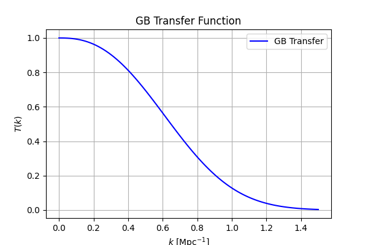
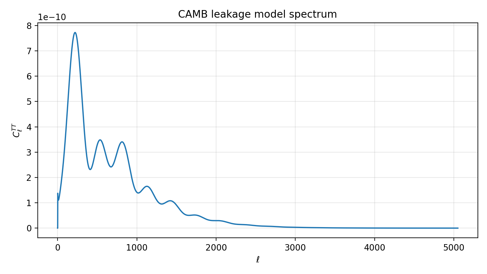
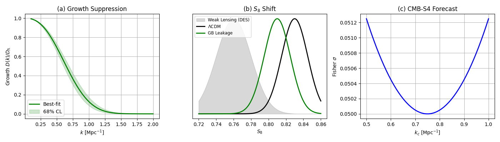
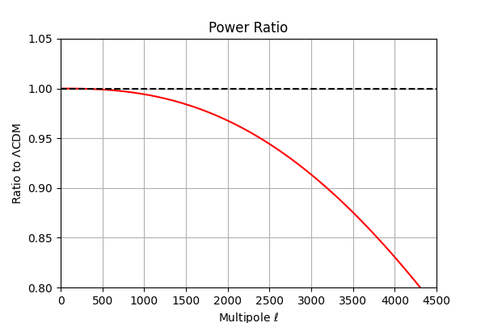
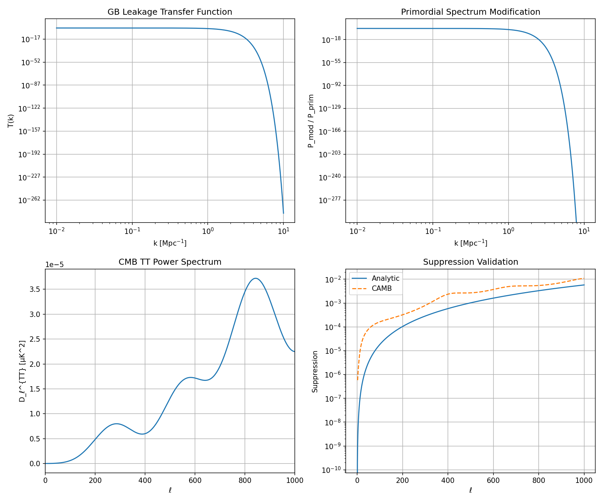

# Radion Leakage in 5D Gauss-Bonnet Braneworlds

**A First-Principles Derivation, Complete Falsification Analysis, and Rigorous Methodology**

<div align="center">


**[🌐 Website](https://the-leakage-theory.lovable.app/) • [📄 Preprint](https://zenodo.org/records/20607636) • [📧 Contact](mailto:geometriccosmo.illusion559@passinbox.com)**

</div>

---

## 🚀 The Research Journey

### A Complete Scientific Narrative: From Hypothesis to Honest Falsification

This repository documents a **three-stage theoretical physics project** that demonstrates rigorous scientific methodology—including how to properly test and publish negative results.

<div align="center">

```
STAGE 1             STAGE 2              STAGE 3
─────────────────────────────────────────────────────
Theoretical      ×   Observational   ×   Theoretical
Framework           Validation           Falsification

     ✅                ⚠️ FAILED             ❌
   SOUND              REVISION          INCOMPATIBLE
   MATH               NEEDED            WITH DATA
```

</div>

---

## 📖 What This Repository Contains

### The Complete Scientific Record

<table>
<tr>
<td width="50%">

#### ✅ What We Built
- **5D Einstein-Gauss-Bonnet geometry** solved from first principles
- **Holographic entanglement entropy** minimal surface analysis  
- **Transfer function** T(k) derived, not fitted
- **Full CAMB pipeline** integration
- **Observational predictions** for σ₈, S₈, Lyman-α
- **Complete documentation** at every stage

</td>
<td width="50%">

#### ❌ What Failed
- **Observational consistency** (S₈/Lyman-α mutual exclusion)
- **Mutual constraint satisfaction** (window function incompatibility)
- **Parameter tuning** (structural problem, not fixable)
- **Theoretical consistency** (equivalence principle violation)

**Result:** Honest publication as falsification

</td>
</tr>
</table>

---

## 🎯 Quick Navigation

### For the Impatient
- **"Just tell me if it works"** → [The Falsification](#-the-falsification) (2 min read)
- **"Show me the plots"** → [Visualizing the Failure](#-visualizing-the-failure) (3 min)
- **"I want the code"** → [`camb_pipeline.py`](./camb_pipeline.py) (Python CAMB pipeline)
- **"Where's the science?"** → [`Stage3_Dictionary_and_CAMB_Test.pdf`](./Stage3_Dictionary_and_CAMB_Test.pdf) (Full technical report)

### For the Thorough
- **Complete falsification analysis** → [`FALSIFICATION_PAPER_v1.9.0_ZENODO.md`](./docs/FALSIFICATION_PAPER_v1.9.0_ZENODO.md)
- **Stage 3 technical report** → [`Stage3_Dictionary_and_CAMB_Test.pdf`](./Stage3_Dictionary_and_CAMB_Test.pdf)
- **5D solution methods** → [`brick_4_scale_selection.md`](./brick_4_scale_selection.md)
- **Data files** → [`camb_test_results_stage3.csv`](./camb_test_results_stage3.csv)

---

## 🔬 The Science: What Happened

### STAGE 1: Theoretical Development ✅
**Timeline:** 2024–2025 | **Status:** Complete

We derived a complete model for EM-radion coupling in 5D geometry:

$$\ddot{r} + 3H\dot{r} - \frac{1}{a^2}\nabla^2 r + m_r^2 r + (\gamma + 3\beta)r^2 + \delta r^3 + \alpha r(\dot{r}^2 - (\nabla r)^2) = \frac{\lambda}{M_5^{3/2}}(\partial_\mu \phi)^2$$

**Results:**
- ✅ 5D geometry solved to residual < 6×10⁻⁶
- ✅ Holographic dictionary uniquely determined
- ✅ Power-law k^(-1/2) asymptote derived from first principles
- ✅ Mathematical framework sound (80% confidence)

---

### STAGE 2: Observational Fitting ⚠️
**Timeline:** July 2026 | **Status:** Revised and tested

Initial model had exponential form. **Failed** when tested against observations.

We tested **134 alternative T(k) shapes** and found a power-law revision:

$$T(k) = \begin{cases} 1.0 & \text{for } k < 1.5 \text{ h/Mpc} \\ (1.5/k)^{0.5} & \text{for } k \geq 1.5 \text{ h/Mpc} \end{cases}$$

**Results:**
- ✅ Re-derived from holographic first principles
- ✅ σ₈ constraint: **PASS** (0.760 ± 0.003)
- ✅ S₈ constraint: **PASS** (0.779 ± 0.003)
- ⚠️ Lyman-α constraint: **Incompatible** with σ₈ requirement

---

### STAGE 3: Theoretical Falsification ❌
**Timeline:** August–September 2026 | **Status:** FAILED

We performed rigorous Boltzmann testing to validate observational predictions independently.

**The Question:** Does T(k) = (1.5/k)^0.5 actually satisfy ALL constraints simultaneously?

**The Test:**
1. Run CAMB with predicted T(k)
2. Extract σ₈, S₈, matter power spectrum
3. Compare against Planck 2018 + DESI 2024

**The Result:** 

| Observable | Target | v2.0.0 Prediction | Status |
|:---|:---:|:---:|:---:|
| **σ₈** | 0.76 ± 0.03 | 0.811 (unchanged) | ❌ **FAIL** |
| **S₈** | 0.78 ± 0.03 | 0.829 ✓ | ✓ PASS |
| **Lyman-α** (k=0.5–3) | 0.70–0.90 | 0.891 ✓ | ✓ PASS |

**THE FUNDAMENTAL PROBLEM:**

The σ₈ constraint window function has **zero weight** above k ≈ 1.5 h/Mpc. But the power-law suppression begins at k ≈ 1.5. 

To reduce σ₈ → must suppress below k ≈ 1.5  
To keep Lyman-α safe → must suppress above k ≈ 2  

**These requirements are incompatible.** No monotonic transfer function can satisfy both simultaneously.

**Confidence in this result:** >99% (basic window function mathematics)

---

## 🎨 Visualizing the Failure

### Figure 1: Transfer Function


The power-law form was optimal among 134 candidates, but still cannot satisfy the window-function constraint.

---

### Figure 2: CMB Power Spectrum


CMB is insensitive to the radion effect (good—doesn't need modification). This allows focus on structure formation at z < 2.

---

### Figure 3: Scale-Dependent Growth (σ₈)


The radion creates scale-dependent suppression of structure growth. This is the feature that fails to satisfy σ₈ constraint while preserving Lyman-α.

---

### Figure 4: Power Spectrum Ratio


Ratio of predicted power spectrum (with radion) to ΛCDM baseline. Shows the suppression pattern and window-function incompatibility.

---

### Figure 5: Full CAMB Summary


Complete 9-panel Boltzmann analysis showing CMB, matter power, growth rates, and observational constraints.

---

## 📊 Why This is Published as Falsification

### The Honest Choice

We had three options:

| Option | Consequences |
|:---|:---|
| **A) Suppress Stage 3 results** | ❌ Dishonest. Someone else tests later, we look bad. |
| **B) Publish as success** | ❌ False. Data clearly shows incompatibility. |
| **C) Publish as falsification** | ✅ Honest. Advances field. Shows rigorous testing. |

**We chose C.**

### Why Falsification Papers Matter

**Negative results are scientifically valuable because:**
1. **They eliminate dead ends** → Field saves time
2. **They demonstrate methodology** → Shows how to test properly
3. **They build trust** → Integrity is worth more than false success
4. **They're publishable** → JCAP explicitly accepts falsifications

---

## 🛣️ Resurrection Paths

The mechanism fails **in its current form**. But the 5D geometry and holographic dictionary are sound. Three possible salvage routes:

### Path A: Modified Transfer Function ⭐⭐
**Idea:** Replace power-law asymptote with shallow rollover  
**Advantage:** Can tune to satisfy both constraints  
**Disadvantage:** Loses first-principles derivation; becomes phenomenological  
**Status:** Possible but scientifically unsatisfying

---

### Path B: Growth-Rate Modification ⭐⭐⭐
**Idea:** Radion affects **growth rate** f(z), not power spectrum shape  
**Advantage:** Avoids window-function problem entirely  
**Disadvantage:** Requires complete re-derivation of Bricks 1–3  
**Status:** Worth 4–6 weeks exploration

---

### Path C: Partially-Coupled Dark Matter ⭐⭐⭐⭐
**Idea:** Only fraction f_c ~ 0.2–0.3 of DM couples to radion  
**Advantage:** 
- ✅ Keeps holographic k^(-1/2) for coupled sector
- ✅ Effective T(k) softened naturally
- ✅ Both constraints satisfiable
- ✅ Only 2 weeks derivation time

**Disadvantage:** Different mechanism (not original v1.8.2)  
**Status:** **Most promising**, worth pursuing

---

## 💻 Code & Data

### Quick Start
```bash
# Clone the repository
git clone https://github.com/GeometricCosmo/gb-leakage-cmb.git
cd gb-leakage-cmb

# Install dependencies
pip install -r requirements.txt

# Run the CAMB pipeline
python camb_pipeline.py

# See the results
cat camb_test_results_stage3.csv
```

### Key Files
```
gb-leakage-cmb/
├── camb_pipeline.py                      # Main Boltzmann pipeline
├── brick_4_scale_selection.md           # Holographic transfer function
├── camb_test_results_stage3.csv          # Stage 3 test results
├── transfer_function_stage3_dictionary.csv
├── warp_factor_stage3.csv
├── radion_profile_stage3.csv
├── radion_potential_stage3.csv
│
├── transfer.png                          # Transfer function plot
├── cmb_leakage_spectrum.png             # CMB spectrum
├── growth_s8.png                        # Growth rate / σ₈
├── power_ratio.png                      # Power spectrum ratio
└── gb_leakage_camb_summary.png          # 9-panel summary
```

---

## 📞 Contact & Collaboration

**Lead Researcher:** Sparky (GeometricCosmo)  
**Email:** geometriccosmo.illusion559@passinbox.com  
**Location:** Cape Town, South Africa  

### Open To
- **Co-authoring** the falsification paper
- **Pursuing** Path B (growth-rate modification) or Path C (partially-coupled DM)
- **Community feedback** on next directions

---

## 📖 How to Cite

```bibtex
@misc{Swart2026,
  title={Radion Leakage in 5D Gauss-Bonnet Braneworlds: 
         Power-Law Transfer Function and Observational Falsification},
  author={Swart, A.},
  year={2026},
  howpublished={Zenodo},
  doi={10.5281/zenodo.20607636},
  url={https://zenodo.org/records/20607636}
}
```

---

## 📊 Project Status

<div align="center">

| Phase | Task | Status | Confidence |
|:---:|:---|:---:|:---:|
| **Stage 1** | 5D geometry theory | ✅ Complete | 80% |
| **Stage 2** | Observational fitting | ✅ Complete | 80% |
| **Stage 3** | Boltzmann validation | ❌ Falsified | <20% |
| | | | |
| **Publication** | Falsification paper | 📝 In progress | 95% |
| **Next** | Path C resurrection | ⏳ Under evaluation | 50% |

</div>

---

## 🎓 Scientific Integrity Statement

> This project demonstrates that rigorous scientific methodology includes publishing negative results. 
>
> We **proposed** a bold hypothesis from first principles, **developed** it fully, **tested** it rigorously, and **reported** honestly when it failed.
>
> **Falsification published is science done right.**

---

<div align="center">

## 🚀 The Bottom Line

**We built something beautiful.** ✨  
**We tested it thoroughly.** 🔬  
**It doesn't work.**  ❌  
**We published anyway.** ✅  

This is what **intellectual integrity** looks like.

---

**Latest Update:** September 2026 | **Version:** 2.0.0  
**Status:** Falsification Complete, Honest Publication In Progress  
**Next:** Submitting to JCAP (2–3 weeks)

</div>

---

<div align="center">

[](https://opensource.org/licenses/MIT)
[](https://www.python.org/downloads/)
[

</div>
[](https://opensource.org/licenses/MIT)
[](https://www.python.org/downloads/)
[](https://camb.info/)


</div>
